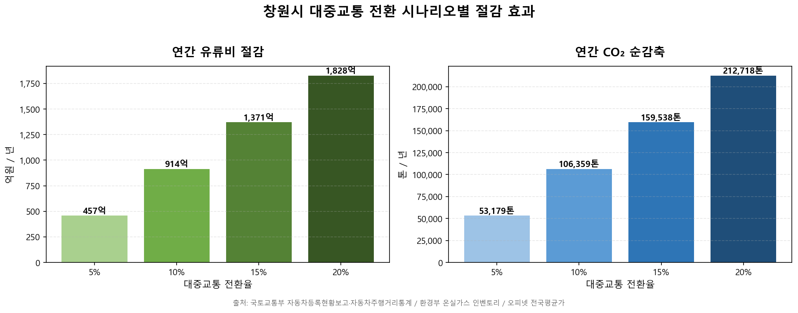

# 영진 — 대중교통 전환율별 절감 효과 차트

**보고서 5번째 시각화** — 자가용 통행이 시내버스로 5/10/15/20% 전환됐을 때 창원시가 얻는
**연간 유류비 절감액과 CO₂ 순감축량** 을 막대그래프로 비교한다.

## 결과 요약

| 전환율 | 연 유류비 절감 | 연 CO₂ 순감축 |
|:---:|---:|---:|
| 5%  | **457 억원** | **53,179 톤** |
| 10% | **914 억원** | **106,359 톤** |
| 15% | **1,371 억원** | **159,538 톤** |
| 20% | **1,828 억원** | **212,718 톤** |



## 산정 모델

```
자가용 절감 통행 = 자가용 등록대수 × 1대 일평균 주행 × 전환율 × 365
휘발유 절감     = 자가용 절감 통행 ÷ 평균 연비(12.5 km/L)
유류비 절감     = 휘발유 절감 × 휘발유 단가(1,700 원/L)
CO₂ 순감축     = 자가용 절감 통행 × (휘발유 CO₂/연비 − 시내버스 CO₂)
```

## 입력 가정 및 출처

| 항목 | 값 | 출처 |
|---|---|---|
| 창원시 자동차 등록대수 | 697,261 대 | KOSIS DT_1YL20731 (국토교통부, 2025) |
| 승용차 비중 | 80% | 국토교통부 자동차등록통계 (전국 평균) |
| 1대당 일평균 주행거리 | 33 km/일 | 국토교통부 「2023 자동차 주행거리 통계」 비사업용 승용 |
| 평균 연비 | 12.5 km/L | 에너지관리공단 자동차 평균 연비 |
| 휘발유 단가 | 1,700 원/L | 오피넷 전국 평균가 (2026.05) |
| 휘발유 CO₂ 배출계수 | 2.31 kgCO₂/L | 환경부 국가 온실가스 인벤토리 |
| 시내버스 CO₂ 배출계수 | 0.0265 kgCO₂/인·km | 환경부 교통수단별 온실가스 배출량 |

## 산출물

| 파일 | 내용 |
|---|---|
| [`conversion_savings.py`](conversion_savings.py) | 계산·xlsx·PNG 생성 스크립트 |
| [`conversion_savings.xlsx`](conversion_savings.xlsx) | 3개 시트 — 가정·출처 / 시나리오 결과 / 차트 |
| [`conversion_savings.png`](conversion_savings.png) | 보고서 삽입용 이미지 (150 dpi) |

## 재실행

```bash
python analysis/yeongjin_chart/conversion_savings.py
```
